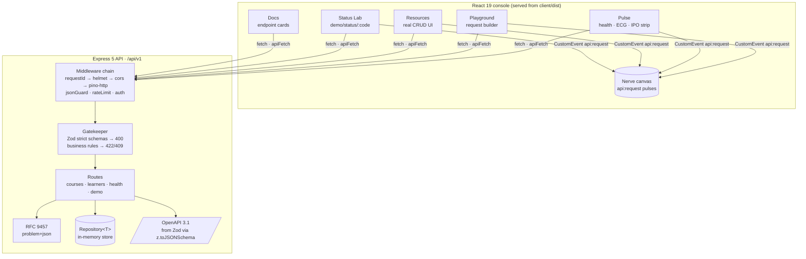

# NeuroAPI — *The nervous system of your app.*

**CourseHub series · Part 1** — DecodeLabs Full Stack Development Industrial Training Kit,
Batch 2026 · **Project 2: Backend API Development.**

The kit asks for a simple backend API: *endpoints (GET/POST), input/response handling, basic
validation.* NeuroAPI delivers all three — then goes well beyond, with every API concept made
visible in the UI: RESTful naming, correct status codes, JSON, the Gatekeeper rule, statelessness,
401 vs 403, rate limiting (429), documentation, and the Input → Process → Output model.

One deployable service: an **Express 5 + TypeScript + Zod 4** API that serves a **React 19**
console from the same URL.

---

## 3-command quick start

```bash
npm install
npm run build
npm start
```

Then open **http://localhost:4000** — the console, the API, the interactive docs (`/reference`)
and the OpenAPI document (`/openapi.json`) all live there.

```bash
npm run dev    # API on :4000 (watch) + console on :5173 (Vite proxies /api)
npm test       # 45 tests — node:test + supertest, all green
```

> Requires **Node ≥ 22.18** (24 LTS recommended). Dev and test run TypeScript natively via
> Node's type stripping — no tsx, no ts-node. The production build is plain `tsc`.

---

## Architecture



**Request lifecycle:** `requestId` → `helmet` → `cors` → `pino-http` → `jsonGuard` (415) →
`express.json` 10kb (413) → `globalLimiter` (429) → `methodNotAllowed` (405) → route →
`writeLimiter` → `requireWriteKey` (401/403) → `validateBody` (400) → semantic checks
(422/409) → repository → `201`/`200` + `Location`. Anything unhandled lands in the global
error handler → generic `500` problem+json, full error in the JSON logs.

---

## Endpoints

Base path `/api/v1` · JSON only · POST responses are never cached (`Cache-Control: no-store`).

| Method | Path | Auth | Success | Notes |
|---|---|---|---|---|
| GET | `/health` _(also `/api/v1/health`)_ | – | 200 | `{status, uptimeSeconds, version, timestamp}` |
| GET | `/courses?level=&q=&page=&limit=` | – | 200 | `{data, meta:{total,page,limit}}`, limit ≤ 50 |
| GET | `/courses/:id` | – | 200 | 400 on malformed uuid, 404 on unknown id |
| POST | `/courses` | write key | 201 + `Location` | 400 / 401 / 403 / 409 (title+date) / 415 / 422 (past date) |
| GET | `/learners?q=&page=&limit=` | – | 200 | paginated, searchable |
| GET | `/learners/:id` | – | 200 | 400 / 404 |
| POST | `/learners` | write key | 201 + `Location` | 409 on duplicate email · **BONUS:** `Idempotency-Key` (10-min TTL) |
| GET | `/demo/status/:code` | – | the real code | 200, 201, 204 (no body), 400, 401, 403, 404, 429, 500 via the real error handler |
| GET | `/openapi.json` | – | 200 | OpenAPI 3.1, schemas generated from Zod |
| GET | `/reference` | – | 200 | Interactive Scalar API reference |
| GET | `/problems/:slug` | – | 200/404 | Human page per problem type |

Rules: plural nouns, no verbs or file extensions in paths · unknown route → 404 ·
known path + wrong method → 405 + `Allow` header · body > 10kb → 413 ·
non-JSON `Content-Type` on write → 415.

---

## Error catalog

Every error is **RFC 9457 `application/problem+json`** with `type, title, status, detail,
instance, requestId` and `errors[{field, code, message}]`. `X-Request-Id` rides on every
response. Stack traces never leak — 500s log the full error and return a generic detail.

| type | status | meaning |
|---|---|---|
| `/problems/validation-error` | 400 | Layer 1: malformed JSON, wrong types, missing/unknown fields (strict schemas) |
| `/problems/semantic-error` | 422 | Layer 2: well-formed but breaks a business rule (past `startDate`) |
| `/problems/duplicate-resource` | 409 | Same course title + start date, or same learner email |
| `/problems/unauthorized` | 401 | Missing/invalid `X-API-Key` (+ `WWW-Authenticate`) |
| `/problems/forbidden` | 403 | Read-only key on a write — authN ok, authZ denied |
| `/problems/not-found` | 404 | Unknown route or id |
| `/problems/method-not-allowed` | 405 | Known path, wrong method (+ `Allow`) |
| `/problems/payload-too-large` | 413 | Body over 10kb |
| `/problems/unsupported-media-type` | 415 | Write without `Content-Type: application/json` |
| `/problems/rate-limited` | 429 | 20 writes/min, 120 req/min per IP (+ `Retry-After`, `RateLimit` headers) |
| `/problems/internal-error` | 500 | Generic detail + requestId; full error in logs |
| `/problems/idempotency-conflict` | 422 | `Idempotency-Key` reused with a *different* body |

---

## AuthN/AuthZ demo (no full auth — by design)

Write operations require `X-API-Key`:

```bash
# missing/invalid → 401 + WWW-Authenticate
curl -X POST localhost:4000/api/v1/courses -H 'Content-Type: application/json' -d '{…}'

# read-only key on POST → 403 (this is the 401-vs-403 lesson, live)
curl -X POST localhost:4000/api/v1/courses \
  -H 'Content-Type: application/json' \
  -H 'X-API-Key: neuro_read_demo_3m8x1z' -d '{…}'

# write key → 201
curl -X POST localhost:4000/api/v1/courses \
  -H 'Content-Type: application/json' \
  -H 'X-API-Key: neuro_write_demo_9f2k7q' \
  -d '{"title":"GraphQL in Practice","level":"intermediate","seats":40,"startDate":"2026-12-01"}'
```

Keys come from `DEMO_WRITE_KEY` / `DEMO_READ_KEY`. In development they fall back to the
documented demo values above; **in production the server refuses to boot without them.**

---

## The console (5 screens)

| Screen | What it proves |
|---|---|
| **Pulse** `/` | Live health chip, ECG latency line from real `/health` polls, animated counters, and an Input → Process → Output strip that lights up on every real request |
| **Playground** `/playground` | Request builder (method, path autocomplete, headers, JSON body with lint), a packet that travels Client → Network → Server and back, highlighted responses, copy-as-cURL/fetch, 10-request history |
| **Resources** `/resources` | Real usage: searchable/filterable/paginated lists, create forms that render the API's field-level errors inline, shared-element card → drawer transition |
| **Status Lab** `/status-lab` | Glass test tubes per status class; buttons fire `/demo/status/:code` and fill the matching tube — 204 with no body, 500 through the real handler |
| **Docs** `/docs` | Endpoint cards with examples, status tables and "Try it" deep-links into the Playground, plus the nine API ideas and where to see each one |

The background is a **living nervous system**: a canvas of Client → Gateway → Server/Service
nerves that fires a bright pulse on every real request — cyan-green for 2xx, amber for 4xx,
coral for 5xx — with speed scaled by latency. Drop a `bg.mp4` + poster into
`client/public/media/` and it becomes a slow Ken Burns layer beneath the nerves.

---

## Environment variables

| Var | Default | Notes |
|---|---|---|
| `PORT` | `4000` | |
| `NODE_ENV` | `development` | `production` on Render; enables key enforcement |
| `CORS_ORIGIN` | `http://localhost:5173` | Comma-separated allowlist; non-listed origins get no CORS headers |
| `DEMO_WRITE_KEY` | demo default (dev) | **Required in production** |
| `DEMO_READ_KEY` | demo default (dev) | **Required in production** |
| `LOG_LEVEL` | `info` | `silent` automatically under `npm test` |

---

## Deploy on Render (one free web service)

1. Push this repo to GitHub.
2. Render → **New → Web Service** → select the repo.
3. **Build command:** `npm install && npm run build`
4. **Start command:** `npm start`
5. Add env vars: `NODE_ENV=production`, `DEMO_WRITE_KEY=<secret>`, `DEMO_READ_KEY=<secret>`.
6. (Optional) set the health check path to `/api/v1/health`.
7. Deploy — the API, console, `/reference` and `/openapi.json` all serve from the one URL.

`trust proxy` is set to one hop (Render's setup) so rate limiting sees real client IPs.

---

## requests.http

`requests.http` at the repo root covers every endpoint in VS Code REST Client format —
set `@base`, `@writeKey`, `@readKey` at the top and run them in order.

---

## What I learned

- **The Gatekeeper rule as architecture, not just validation.** Splitting "syntactic"
  (Zod strict schemas → 400) from "semantic" (business rules → 422, duplicates → 409)
  made every error message honest about *what kind* of wrong the request was.
- **Errors are a contract.** RFC 9457 gave every failure the same shape — including the
  `requestId` that ties a client-visible problem to a server-side log line. Debugging
  stories get much shorter when both sides quote the same id.
- **401 vs 403 is a sentence, not a footnote.** Wiring a real read-only key through the
  Playground turned an interview-trivia distinction into something you can *feel*.
- **Docs generated from schemas can't drift.** `z.toJSONSchema()` means the OpenAPI
  document is a build artifact of the validation code, not a parallel manuscript.
- **Node runs TypeScript natively now** (≥22.18 type stripping) — but only with explicit
  `.ts` specifiers; the `.js`-import convention is a `tsc` thing. `tsc` bridges both worlds
  with `allowImportingTsExtensions` + `rewriteRelativeImportExtensions`.
- **Rate limiters share state per process** — which is why the 429 test lives last in its
  file and per-file budgets stay under the caps.

## Project 3 note

Persistence sits behind `Repository<T>` (`server/src/domain/repository.ts`). The in-memory
store is one implementation; Project 3 swaps it for a real database without touching a
single route.
